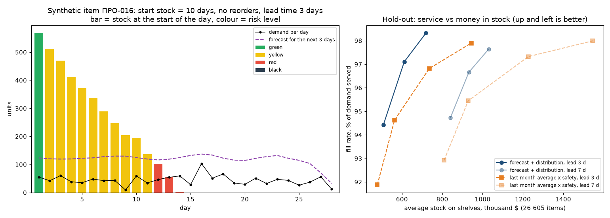

# Прогноз спроса и остатков для магазина

Хотел сделать то, чего мне не хватало, когда я консультировал селлеров на маркетплейсах: не просто прогноз продаж, а подсказку, что и когда заказать, чтобы полка не опустела и деньги не лежали в лишнем запасе. И чтобы это работало не только у сети с пятилетней историей, а у обычного магазина, у которого есть выгрузка продаж из кассы или 1С.

Обучал и проверял на данных соревнования [M5 Forecasting](https://www.kaggle.com/competitions/m5-forecasting-accuracy): дневные продажи Walmart, 10 магазинов, 3049 товаров, 2011–2016.

**Демо:** [mejick.github.io/demand-forecast](https://mejick.github.io/demand-forecast/)

## Что получилось

На последних 28 днях, которые ни одна модель не видела до финальной проверки:

| Модель | WRMSSE ↓ |
|---|---|
| LightGBM + N-HiTS (среднее) | **0,754** |
| LightGBM | 0,762 |
| N-HiTS | 0,763 |
| LightGBM без идентификатора товара (универсальная, для демо) | 0,767 |
| Лучшее простое правило (среднее за 28 дней × недельный профиль) | 0,777 |

Это −3% к простому правилу. Само по себе немного, но дальше прогноз превращается в правило заказа, и тут разница уже в деньгах. Я проиграл склад день за днём на 26 605 товарах: при одинаковом уровне обслуживания 97–98% правило на основе прогноза держит в запасе на 16–24% меньше денег, чем привычное «заказывай по среднему за прошлый месяц с запасом».

| Срок поставки | Обслужено спроса | По прогнозу | Среднее × запас |
|---|---|---|---|
| 3 дня | ~97% | $611 тыс. | $735 тыс. |
| 3 дня | ~98% | $719 тыс. | $944 тыс. |
| 7 дней | ~97,5% | $1,03 млн | $1,23 млн |



Слева видно, как меняется статус одного товара, если его не дозаказывать. Товар синтетический, из демо, потому что реальные продажи отдельных товаров M5 выкладывать нельзя. Справа симуляция склада на отложенной выборке.

## Демо

[Открыть демо](https://mejick.github.io/demand-forecast/). Можно загрузить CSV с продажами и получить прогноз на 28 дней с диапазоном, статус по каждому товару, сколько заказать и до какого числа. Всё считается в браузере, файл никуда не уходит.

Для демо я обучил отдельную модель только на том, что есть у любого магазина: история продаж и календарь, без идентификаторов товаров Walmart, американских праздников и цен. На последнем окне валидации она дала 0,776: хуже полной модели (0,762), но лучше простых правил (0,782). Деревья выгружены в JSON, в браузере их считает небольшой интерпретатор. Тест `tests/test_demo.py` прогоняет его в Node и сверяет с Python, прогнозы совпадают до четвёртого знака.

Кнопка «Попробовать на примере» загружает синтетический магазин (`docs/sample_synthetic_store.csv`). Данные M5 выкладывать нельзя, поэтому пример сгенерирован по закономерностям, которые нашлись в M5: недельный цикл, закупки накануне праздников, дни зарплаты, редкие и «пачечные» товары, новинка и провалы в наличии.

Свой файл: колонки `date`, `sku`, `sold` обязательны, `stock` (остаток на конец дня), `price` и `category` по желанию. Остаток можно вписать и прямо в таблице на странице.

## Как это устроено

**Спрос, а не продажи.** В M5 нет остатков, а 60% строк нулевые. Ноль бывает «никто не купил», а бывает «товара не было на полке», и если учить модель на вторых, она научится занижать прогноз. Поэтому каждому товару в каждый день я присвоил статус: ещё не введён, в продаже, нет на полке, снят с продажи. «Нет на полке» определяю по вероятности: серия нулей длиной L у товара, который продаётся в доле дней p, случайно бывает с вероятностью (1 − p)^L, и если она меньше 0,1%, считаю, что товара не было. На перемешанных во времени продажах правило срабатывает на 1,4% дней против 15,7% на реальных, то есть почти все пометки не случайны. Ещё смотрел глазами на десятке товаров: первая версия правила по средним продажам перегибала на редких товарах, поэтому перешёл на долю дней с продажами.

**Признаки** (39): лаги 28–56 дней, скользящие средние по дням в наличии, доля дней с продажами и размер покупки, день недели и месяца, дни до и после крупных праздников, дни выдачи продуктовых талонов (SNAP), цена, возраст товара. Прогноз на 28 дней делаю прямой стратегией, поэтому всё, что считается из продаж, сдвинуто минимум на 28 дней. Тест утечки подменяет продажи после даты среза случайными числами и проверяет, что ни один признак для прогнозируемых дней не изменился.

**Валидация.** Три окна по 28 дней внутри обучающего периода и отдельная отложенная выборка, которую открыл один раз в самом конце. Ранняя остановка бустинга идёт по последним 28 дням внутри обучения, а не по окну проверки.

**От прогноза к решению.** Вокруг прогноза строю отрицательное биномиальное распределение с разбросом по истории каждого товара. Для недельных сумм ошибки соседних дней связаны, поэтому разброс увеличен в 1,5 раза. Коэффициент подобрал на двух окнах и проверил на третьем и на отложенной выборке: квантиль 90% покрывает 90,5% реальных недель. Из распределения считается вероятность, что товар кончится до прихода поставки, и статус:

- ⚫ полка уже пустая
- 🔴 кончится до прихода поставки с вероятностью от 50%, заказывать сегодня
- 🟡 за срок поставки плюс неделю кончится с вероятностью от 10%, заказать в ближайшие дни
- 🟢 запаса хватает

## Что я узнал по ходу

Классика рядов не обогнала простые правила. ETS, Theta, ADIDA и IMAPA все в районе 0,80, как «среднее за месяц». Своя модель на каждый товар не видит ни цен, ни праздников, ни соседних товаров, а одна общая модель учится сразу на 30 тысячах рядов.

Ансамбль помогает, только если модели ошибаются по-разному. LightGBM и CatBoost ошибаются почти одинаково (корреляция ошибок 0,97), их смесь дала −0,003. Слабая линейная модель в паре с LightGBM дала больше, чем сильный CatBoost. А N-HiTS, который смотрит на сырой ряд, а не на признаки, сравнялся с бустингом и в паре с ним дал лучший результат.

Линейной модели нужен уровень ряда. Пуассоновская регрессия в лоб проиграла простому среднему (0,816 против 0,796): один общий коэффициент при уровне продаж сжимает прогноз к среднему по всем товарам. С собственным уровнем товара в качестве смещения получилось 0,794.

Нормализация может всё сломать. N-HiTS с нормализацией по входному окну выдал WRMSSE 139, потому что у редких товаров 56 дней подряд одинаковые значения и деление идёт почти на ноль. С нормализацией по всей истории ряда вышло 0,780.

CPU и GPU не одно и то же. CatBoost с функцией потерь Tweedie на видеокарте занижал прогноз на 43%, тот же код на процессоре работал нормально. Нашёл это на подвыборке, прежде чем винить модель.

Корреляция цены с продажами обманчива. Сильные скидки в M5 идут вместе с падением продаж: это распродажи уходящих товаров, а не реакция покупателей на цену. Эластичность на этих данных честно не оценить, поэтому рекомендаций по цене в проекте нет.

Канун важнее самого праздника. В День независимости продажи −2%, а накануне +28%. В дни выдачи продуктовых талонов продукты в Висконсине продаются на 28% больше.

## Ограничения

Остатков в данных нет, статус «нет на полке» вычислен, а не известен. У бизнеса с выгрузкой остатков он берётся напрямую. Себестоимости тоже нет, поэтому склад оцениваю в ценах продажи и маржу не считаю.

В M5 всего 3 категории и 7 отделов на 3049 товаров. В реальном справочнике уровней больше, и, думаю, от них будет больше пользы, особенно для новинок без истории.

Моя метрика считается по нижнему уровню M5 (товар × магазин) и только по дням в наличии. С лидербордом Kaggle (12 уровней агрегации, все дни) она не сравнима. Сроки поставки в симуляции заданы числом, в жизни у них свой разброс.

## Запуск

Данные M5 публиковать нельзя по правилам соревнования, их нужно скачать самому:

```bash
pip install -r requirements.txt
kaggle competitions download m5-forecasting-accuracy -p data
unzip data/m5-forecasting-accuracy.zip -d data
cd src
python build_long.py
python status.py
python split.py
python train.py features
python train.py lgbm
python train.py nhits
python blend.py
python uncertainty.py
python inventory.py
python final.py
```

По порядку: собираю из трёх таблиц одну длинную, считаю статусы товаров, откладываю последние 28 дней, строю признаки и учу LightGBM, потом N-HiTS (ему нужна видеокарта), смешиваю их, строю распределение и симулирую склад. `final.py` запускается один раз в самом конце, это проверка на отложенной выборке. Остальные модели запускаются так же: `python train.py rules`, `ets`, `theta`, `glm_offset`, `catboost`, `deepar`.

## Где что лежит

Исследование данных в ноутбуке `notebooks/01_eda.ipynb`.

В `src` подготовка и проверки: `build_long.py` собирает данные, `status.py` размечает статусы товаров, `check_status.py` проверяет это правило, `split.py` откладывает последние 28 дней, `features.py` считает признаки, `test_leakage.py` проверяет их на утечку, `cv.py` отвечает за окна валидации и метрику.

Каждая модель в своём файле в `src/models`: простые правила в `rules.py`, ETS, Theta и другие модели на каждый ряд в `statistical.py`, пуассоновская регрессия в `linear.py`, дальше `lgbm.py`, `catboost_model.py` и `neural.py` с N-HiTS и DeepAR. Общее для них лежит в `common.py`, запускаются все через `train.py`.

После моделей идут `blend.py` (смеси), `uncertainty.py` (распределение и калибровка), `inventory.py` (статусы и симуляция склада) и `final.py`. В `debug_catboost.py` осталось, как я искал баг CatBoost на видеокарте.

Для демо `demo_model.py` учит универсальную модель, `export_demo.py` выгружает её в JSON, `make_sample.py` генерирует синтетический магазин, `figure_risk.py` рисует график статусов. В `docs` сама страница: расчёт прогноза в `core.js`, интерфейс в `app.js`. В `reports` графики и таблицы с результатами.

## Лицензия

Код под лицензией MIT. Данные M5 в репозиторий не входят, они распространяются по правилам соревнования.
